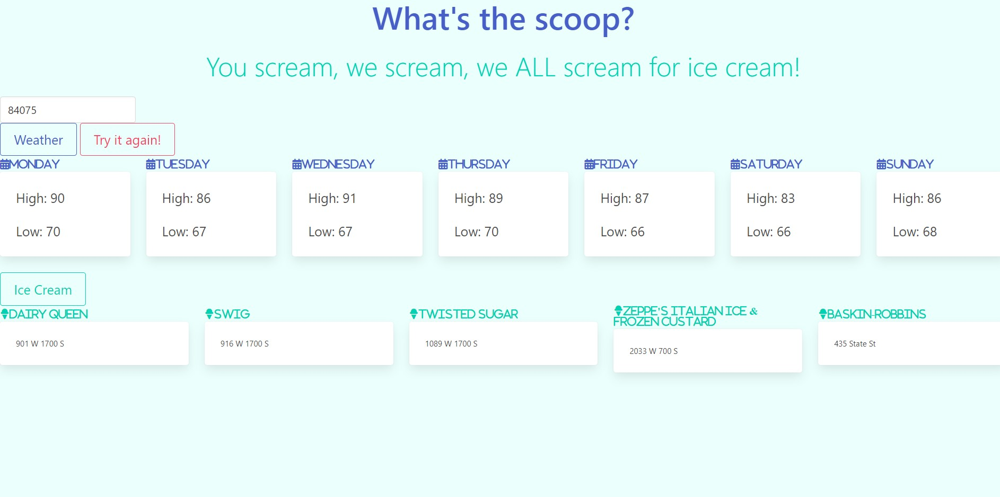

# What's The Scoop

# Overview

A user should be able to enter a geographical location that will than pull up weather data from there. Using the same data a user will than be able to pull up all places that sell ice cream within that location

It's a hot day outside and you are craving ice cream. Using our application it will give you the nearest ice cream shops and the weather for you to than determine if its too cold or the perfect weather to fullfill your cravings. 

# Gallery

# Features
* MapQuest API
* Weatherbit Api
* JavaScript
* Bulma
* Moment.js

# Problem
We don't know how to search the weather for certain areas based off zipcode, or find the nearest ice cream shops and location. 

# Solution
Our application allows users to find the high and low temperature of a certain area based off postal code. Than the postal code gets stored to local storage and allows the user to find the nearest ice cream stores and street addresses.

# Deployed site

[live link to What's The Scoop](https://philliprose.github.io/Project-01/)